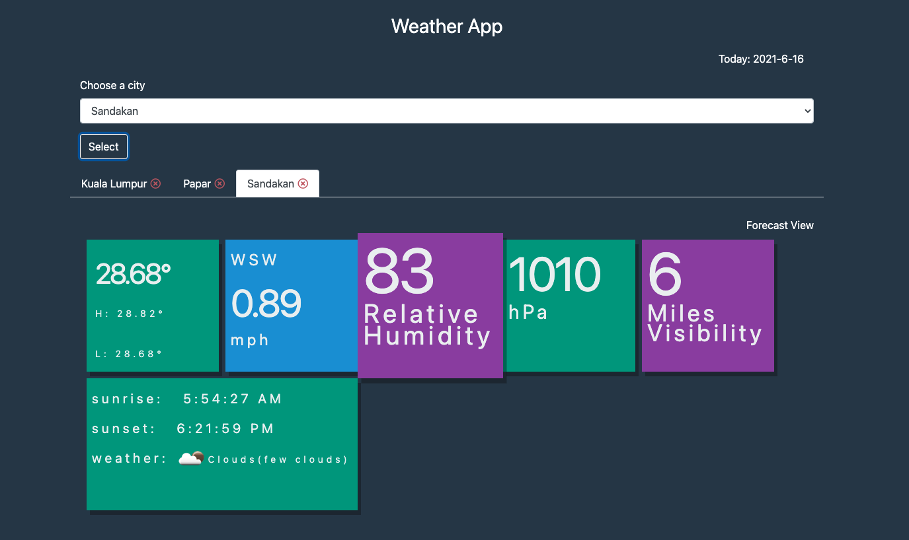
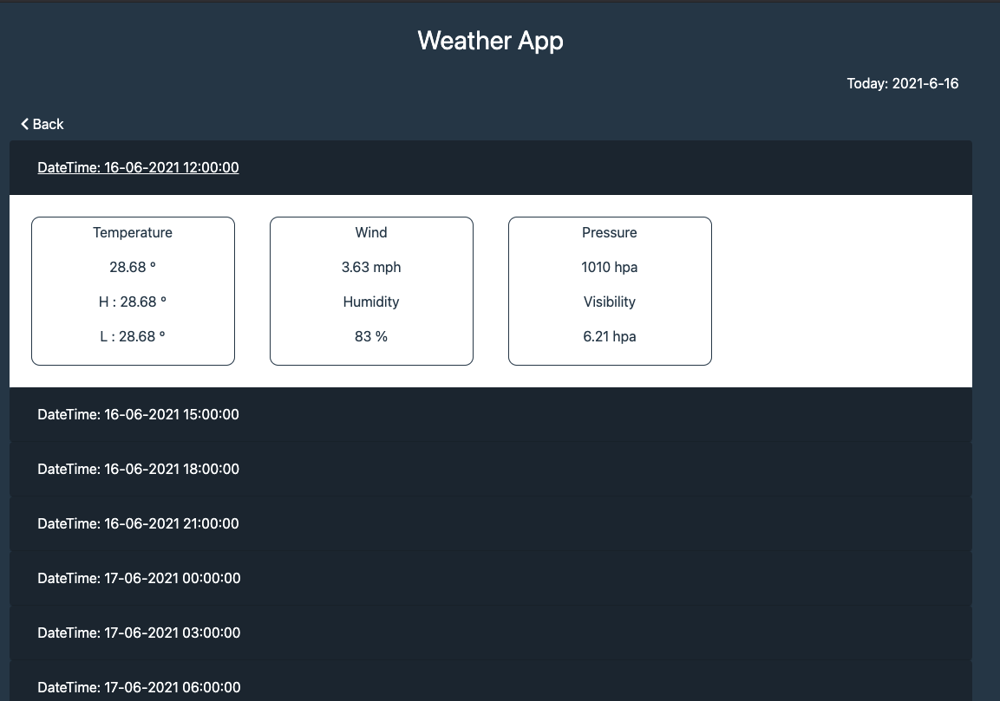

## Weather App

Django application to view weather informations.


### Pages

> Home Page




> Forecast Page




### Setup

Install application dependencies.

```bash
$ pip install -r requirements.txt 
```

Add secret key and openweather api key to `env` file. sample of `env` file is available in repo. all necessary files will be available in the gdrive link below.

Run migration

```bash
$ python manage.py migrate
```

Run Server

```bash
$ python manage.py runserver
```

> Gdrive link: [click here](https://drive.google.com/drive/u/2/folders/1hdkLIA6ki7vuENB48AoXdwIfBDjU6mik)

